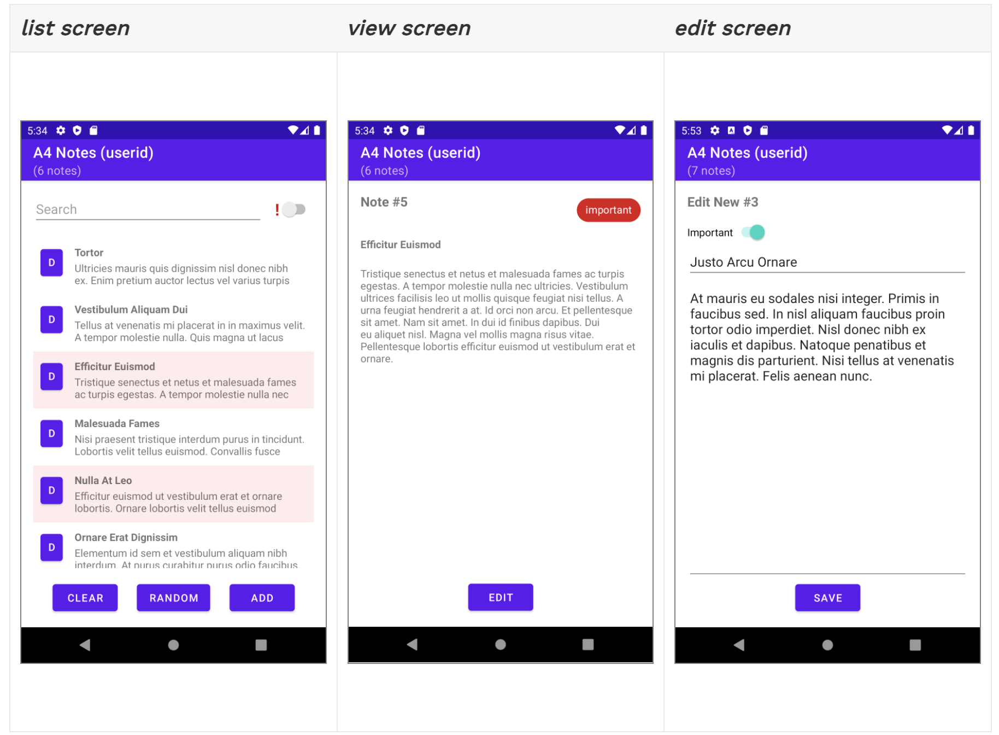

# A4 Notes
This APP built using Android SDK, Kotlin, and MVVM. It has both landscape and portrait, support rotating.

## Setup
* macOS 12.1 
* IntelliJ IDEA 2021.12 (Community Edition)
* kotlin.jvm 1.6.10
* Java SDK 16.0.2 (temurin)

## This is how the APP looks like:

